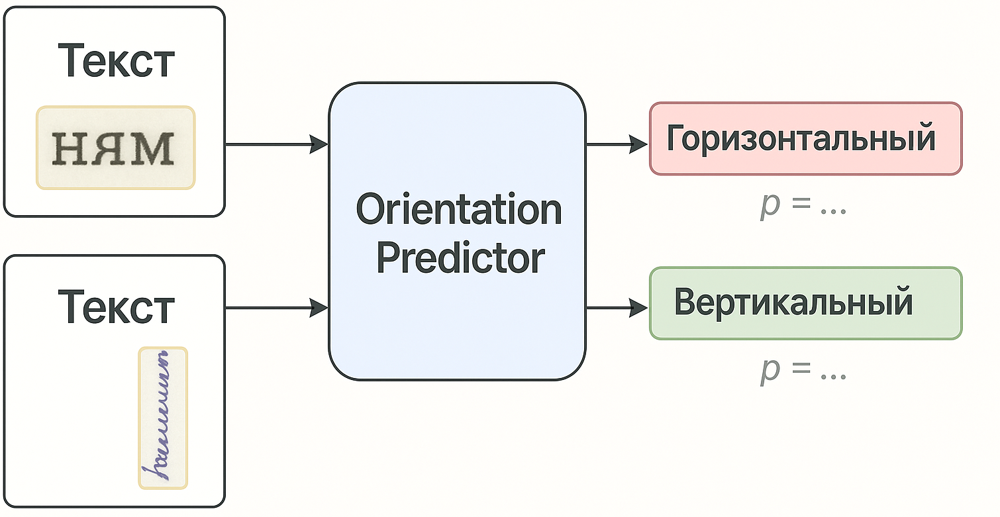

# ocra

**ocra** — Python-библиотека с инструментами анализа фрагментов печатного текста (сканы, вырезки и т.п.).
Первый инструмент — **`OrientationPredictor`**: 

## Установка

```bash
# С CPU поддержкой
pip install ocra[cpu] 

# С GPU поддержкой (требует CUDA + cuDNN)
pip install ocra[gpu]
```

---

## OrientationPredictor 
Определяет ориентацию фрагмента как `HORZ` (горизонт) или `VERT` (вертикаль).

Пример:
```python
from ocra import OrientationPredictor

IMAGE_PATH = r"examples\hrk_463.png"

def main():
    model = OrientationPredictor()

    result = model.predict_single(IMAGE_PATH)
    label = "VERT" if result["pred_class"] == 1 else "HORZ"

    print("Path:", result["path"])
    print("Pred:", label, f"(class={result['pred_class']})")
    print(f"Prob VERT: {result['prob_vertical']:.4f}")
    print(f"Prob HORZ: {result['prob_horizontal']:.4f}")
    print(f"Aspect (w/h): {result['aspect_ratio']:.4f}")

if __name__ == "__main__":
    main()
```

Пример вывода:

```
Path: examples\hrk_463.png
Pred: HORZ (class=0)
Prob VERT: 0.0001
Prob HORZ: 0.9999
Aspect (w/h): 6.5926
```
