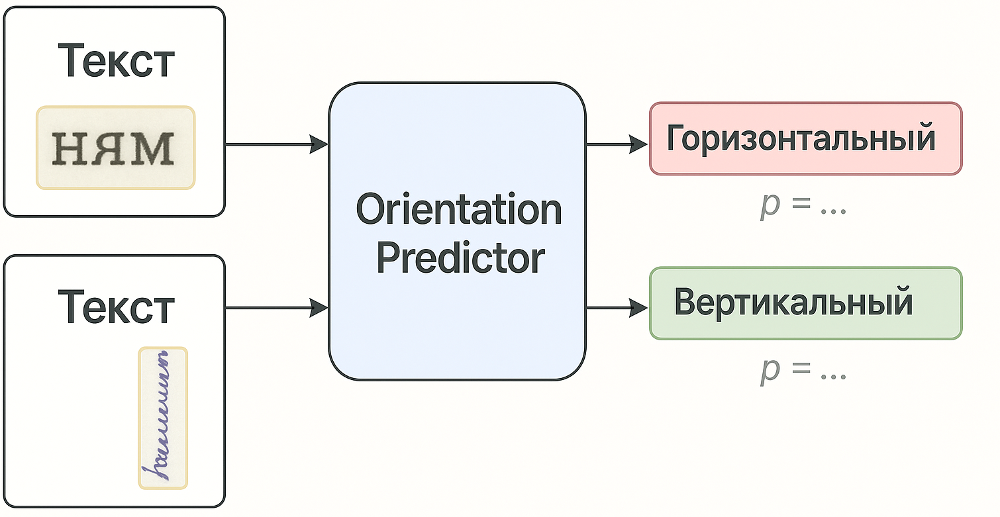
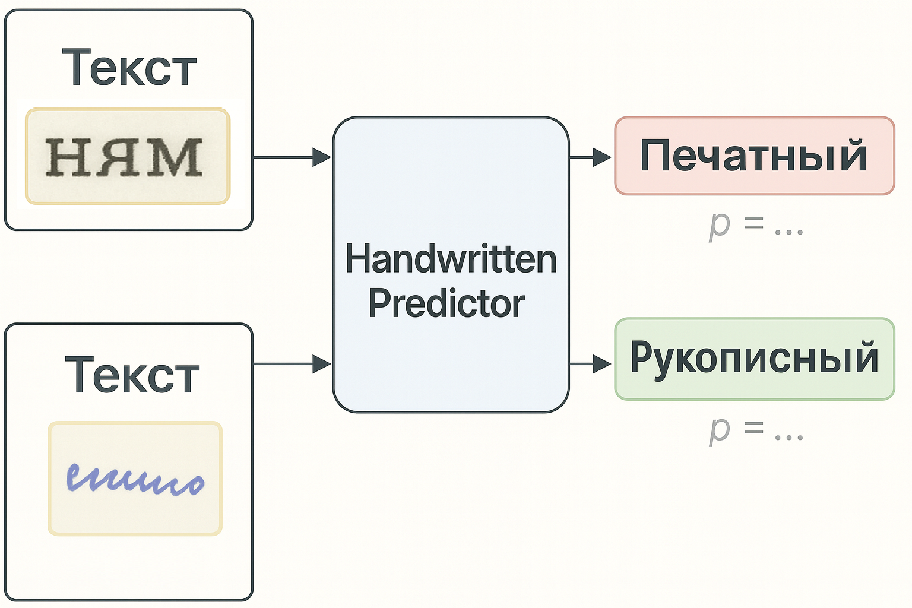

# ocra

**ocra** — Python-библиотека для анализа изображений текста (сканы, вырезки и т.п.).

Два основных инструмента:
- **`OrientationPredictor`** — определение ориентации (вертикальная/горизонтальная)
- **`HandwrittenPredictor`** — классификация типа текста (рукописный/печатный)

## Установка

### Для использования (inference)

```bash
# С CPU поддержкой
pip install ocra[cpu] 

# С GPU поддержкой (требует CUDA + cuDNN)
pip install ocra[gpu]
```

**Примечание:** ONNX модели загружаются автоматически при первом использовании из GitHub Releases.
Модели кешируются в `~/.cache/ocra/`.

📥 **Подробнее о моделях:** [MODELS.md](MODELS.md)

### Для обучения моделей

Для обучения требуются дополнительные зависимости и PyTorch.

📦 **См. детальные инструкции:** [TRAIN_README.md](TRAIN_README.md)

Краткая версия:
```bash
# 1. Установить PyTorch для вашей версии CUDA
pip install torch torchvision --index-url https://download.pytorch.org/whl/cu118

# 2. Установить dev зависимости
pip install -e ".[dev,gpu]"
```

🚀 **Быстрый старт обучения:** [QUICKSTART.md](QUICKSTART.md)

---

## Быстрый старт

```python
from ocra import OrientationPredictor
from ocra import HandwrittenPredictor

def main():
    # Инициализация
    orient_pred = OrientationPredictor(verbose=0)
    text_pred = HandwrittenPredictor(verbose=False)
    
    image = "examples/hrk_463.png"
    
    # Определение ориентации
    orient_res = orient_pred.predict_single(image)
    orientation = "VERT" if orient_res['pred_class'] == 1 else "HORZ"
    
    # Определение типа текста
    text_res = text_pred.predict_single(image)
    text_type = text_res['prediction']  # 'handwritten' или 'printed'
    
    print(f"Ориентация: {orientation} ({orient_res['confidence']:.3f})")
    print(f"Тип текста: {text_type} ({text_res['confidence']:.3f})")

if __name__ == "__main__":
    main()
```

**Пример вывода:**
```
Ориентация: HORZ (1.000)
Тип текста: handwritten (0.982)
```

---

## OrientationPredictor 
Определяет ориентацию изображения как горизонтальную (HORZ) или вертикальную (VERT).



```python
from ocra import OrientationPredictor

predictor = OrientationPredictor()
result = predictor.predict_single("examples/hrk_463.png")

print(f"Класс: {result['pred_class']}")  # 0=HORZ, 1=VERT
print(f"Предсказание: {result['prediction']}")  # 'horizontal' или 'vertical'
print(f"Уверенность: {result['confidence']:.4f}")
```

## HandwrittenPredictor
Классифицирует тип текста на изображении: рукописный или печатный.



```python
from ocra import HandwrittenPredictor

predictor = HandwrittenPredictor()
result = predictor.predict_single("examples/hrk_463.png")

print(f"Класс: {result['pred_class']}")     # 0=printed, 1=handwritten
print(f"Предсказание: {result['prediction']}")  # 'handwritten' или 'printed'
print(f"Уверенность: {result['confidence']:.4f}")
print(f"Высокая уверенность: {result['high_confidence']}")
```
